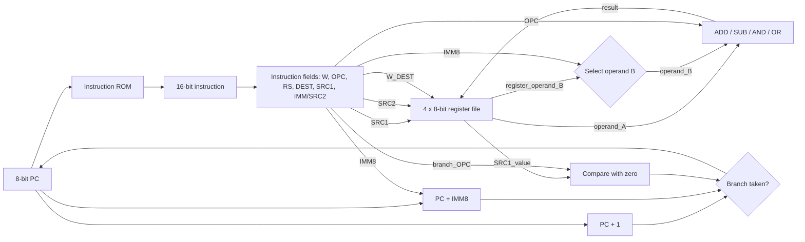

# ADEL Processor

**ADEL** — **Architecture Design that's Easy to Learn** — is a minimal custom processor and instruction set architecture designed for teaching introductory computer architecture. Its goal is to expose the complete path from an encoded instruction to register-file access, arithmetic/logic execution, writeback, instruction sequencing, and conditional control flow without the additional complexity of a production ISA.

ADEL intentionally keeps the architectural state and instruction format small:

- **16-bit fixed-width instructions**
- **8-bit datapath**
- **4 general-purpose 8-bit registers** (`R0`–`R3`)
- **8-bit program counter**
- **Register-register and register-immediate ALU operations**
- **PC-relative conditional branches**
- **Single-cycle execution**
- **No data memory, load/store instructions, status register, or pipeline**

The processor is small enough for the complete instruction encoding and datapath to be discussed as a single coherent design, while still supporting non-trivial programs containing arithmetic, bitwise operations, loops, multiplication by repeated addition, division by repeated subtraction, and Fibonacci-style recurrences.

---

## Architecture at a Glance

| Property | ADEL |
|---|---|
| Instruction width | 16 bits |
| Data width | 8 bits |
| General-purpose registers | 4 × 8-bit (`R0`–`R3`) |
| Program counter | 8 bits |
| Instruction address space | 256 instruction words |
| ALU operations | ADD, SUB, AND, OR |
| Immediate width | 8 bits |
| Immediate representation | Two's complement |
| Branch conditions | EQ, NE, LT, GT relative to zero |
| Branch addressing | PC-relative |
| Execution model | Single-cycle |
| Register write | Rising clock edge |
| Reset | Active-low; clears PC and register file |

All four registers are ordinary writable registers; there is no hardwired zero register. Arithmetic results are stored in 8 bits and therefore naturally wrap modulo 256.

---

# Instruction Set Architecture

## 16-bit Instruction Format

Every instruction uses the same 16-bit format.

```text
 15    14 13    12    11 10     9 8       7                 0
+---+----------+---+----------+--------+------------------------+
| W |   OPC    | RS|   DEST   |  SRC1  |      CONST / SRC2      |
+---+----------+---+----------+--------+------------------------+
  1      2       1      2         2                8
```

| Field | Bits | Description |
|---|---:|---|
| `W` | 15 | Register-file write control. `1` selects an ALU instruction; `0` selects a branch instruction. |
| `OPC` | 14:13 | Operation code. Its interpretation depends on `W`. |
| `RS` | 12 | Selects the second ALU operand: immediate (`0`) or register (`1`). For branches, this field is unused and encoded as `0`. |
| `DEST` | 11:10 | Destination register for ALU instructions. Unused by branches and encoded as `00`. |
| `SRC1` | 9:8 | First source register. For branches, this is the register compared against zero. |
| `CONST/SRC2` | 7:0 | Either an 8-bit immediate/branch displacement or the second source-register encoding. |

The format deliberately allows instruction bits to drive the datapath almost directly. A separate instruction decoder is not required for most fields: the register selectors, ALU selector, operand selector, and write-enable signal are already present in the instruction itself.

---

## Register Encoding

ADEL contains four 8-bit general-purpose registers.

| Register | Encoding |
|---|---:|
| `R0` | `00` |
| `R1` | `01` |
| `R2` | `10` |
| `R3` | `11` |

The same mapping is used by `DEST`, `SRC1`, and `SRC2`.

For register-register instructions, the upper six bits of the `CONST/SRC2` field are zero and the register number is placed in bits `[1:0]`:

```text
00000000  -> R0
00000001  -> R1
00000010  -> R2
00000011  -> R3
```

---

# ALU Instructions

When `W = 1`, the instruction is an arithmetic or logical operation and `OPC` selects the ALU function.

| `OPC` | Operation |
|---:|---|
| `00` | ADD |
| `01` | SUB |
| `10` | AND |
| `11` | OR |

`RS` selects the form of the second operand:

- `RS = 1`: register-register instruction
- `RS = 0`: register-immediate instruction

The first operand is always the register selected by `SRC1`.

## Register-Register Form

```text
OP DEST, SRC1, SRC2
```

Semantically,

```text
R[DEST] <- R[SRC1] OP R[SRC2]
```

For this form, `RS = 1` and bits `[7:2]` are zero.

| Instruction | Semantics |
|---|---|
| `ADD Rd, Rs1, Rs2` | `Rd = Rs1 + Rs2` |
| `SUB Rd, Rs1, Rs2` | `Rd = Rs1 - Rs2` |
| `AND Rd, Rs1, Rs2` | `Rd = Rs1 & Rs2` |
| `OR Rd, Rs1, Rs2` | `Rd = Rs1 \| Rs2` |

Example:

```asm
SUB R1, R3, R2
```

performs

```text
R1 <- R3 - R2
```

and assembles to:

```text
W   OPC  RS  DEST  SRC1  CONST/SRC2
1   01   1    01    11    00000010

1011 0111 0000 0010 = 0xB702
```

## Register-Immediate Form

```text
OPI DEST, SRC1, IMM8
```

Semantically,

```text
R[DEST] <- R[SRC1] OP IMM8
```

The immediate occupies bits `[7:0]` and is encoded in 8-bit two's-complement form. The assembler uses the `I` suffix to distinguish immediate instructions.

| Instruction | Semantics |
|---|---|
| `ADDI Rd, Rs1, imm8` | `Rd = Rs1 + imm8` |
| `SUBI Rd, Rs1, imm8` | `Rd = Rs1 - imm8` |
| `ANDI Rd, Rs1, imm8` | `Rd = Rs1 & imm8` |
| `ORI Rd, Rs1, imm8` | `Rd = Rs1 \| imm8` |

Example:

```asm
SUBI R3, R1, -31
```

is encoded as:

```text
W   OPC  RS  DEST  SRC1      IMM8
1   01   0    11    01      11100001

1010 1101 1110 0001 = 0xADE1
```

Since `0xE1` is the 8-bit two's-complement representation of `-31`, the instruction performs:

```text
R3 <- R1 - (-31)
```

---

# Branch Instructions

When `W = 0`, the instruction is interpreted as a conditional branch rather than an ALU/writeback instruction.

The branch tests the value of `R[SRC1]` relative to zero. `OPC` is therefore re-used as a branch-condition code.

| `OPC` | Mnemonic | Branch condition |
|---:|---|---|
| `00` | `BEQ` | `R[SRC1] == 0` |
| `01` | `BNE` | `R[SRC1] != 0` |
| `10` | `BLT` | `R[SRC1] < 0` |
| `11` | `BGT` | `R[SRC1] > 0` |

The branch format is:

```asm
Bcc SRC1, offset
```

For all branch instructions:

```text
W    = 0
RS   = 0
DEST = 00
```

and the 8-bit `CONST` field is interpreted as a signed PC-relative displacement.

A taken branch updates the program counter as:

```text
PCnext = PC + offset
```

A non-taken branch proceeds sequentially:

```text
PCnext = PC + 1
```

The displacement is relative to the **address of the branch instruction itself**, not to `PC + 1`.

Because the PC and branch displacement are both 8 bits in the implementation, PC arithmetic naturally wraps modulo 256.

## Branch Example

```asm
BNE R2, -2
```

encodes as:

```text
W   OPC  RS  DEST  SRC1      OFFSET
0   01   0    00    10      11111110

0010 0010 1111 1110 = 0x22FE
```

If `R2 != 0`, execution continues at `PC - 2`. Otherwise, execution continues at `PC + 1`.

---

# Complete Instruction Set

| Mnemonic | Syntax | `W` | `OPC` | `RS` | Operation |
|---|---|---:|---:|---:|---|
| `ADD` | `ADD Rd, Rs1, Rs2` | 1 | 00 | 1 | `Rd = Rs1 + Rs2` |
| `ADDI` | `ADDI Rd, Rs1, imm8` | 1 | 00 | 0 | `Rd = Rs1 + imm8` |
| `SUB` | `SUB Rd, Rs1, Rs2` | 1 | 01 | 1 | `Rd = Rs1 - Rs2` |
| `SUBI` | `SUBI Rd, Rs1, imm8` | 1 | 01 | 0 | `Rd = Rs1 - imm8` |
| `AND` | `AND Rd, Rs1, Rs2` | 1 | 10 | 1 | `Rd = Rs1 & Rs2` |
| `ANDI` | `ANDI Rd, Rs1, imm8` | 1 | 10 | 0 | `Rd = Rs1 & imm8` |
| `OR` | `OR Rd, Rs1, Rs2` | 1 | 11 | 1 | `Rd = Rs1 \| Rs2` |
| `ORI` | `ORI Rd, Rs1, imm8` | 1 | 11 | 0 | `Rd = Rs1 \| imm8` |
| `BEQ` | `BEQ Rs, offset` | 0 | 00 | 0 | Branch if `Rs == 0` |
| `BNE` | `BNE Rs, offset` | 0 | 01 | 0 | Branch if `Rs != 0` |
| `BLT` | `BLT Rs, offset` | 0 | 10 | 0 | Branch if `Rs < 0` |
| `BGT` | `BGT Rs, offset` | 0 | 11 | 0 | Branch if `Rs > 0` |

There are no dedicated move, clear, compare, unconditional-jump, or halt instructions. These can be synthesized from the existing ISA where needed. For example:

```asm
ADDI R1, R2, 0     # R1 <- R2
SUB  R3, R3, R3    # R3 <- 0
```

A program can stop useful execution by entering a self-branch whose condition is known to be true.

---

# Hardware Implementation

ADEL is a single-cycle datapath. The current instruction is decoded combinationally, its operands are read from the register file, the selected operation or branch condition is evaluated, and architectural state is updated on the next rising clock edge.



## Instruction Fetch and Program Counter

The full teaching datapath uses a read-only instruction memory addressed by the program counter. During normal execution, the PC advances by one instruction every cycle.

The HDL core separates the processor from its instruction memory:

```systemverilog
input  [15:0] inst;
output reg [7:0] pc;
```

This makes the interface suitable for connecting an external ROM or instruction-memory module:

```text
pc -> instruction memory address
instruction memory data -> inst
```

With an 8-bit PC, up to 256 instruction addresses can be represented.

## Register File

The register file contains four 8-bit registers. Two registers can be read combinationally for the source operands, while one destination register can be updated on the rising clock edge.

The instruction directly supplies:

```text
DEST -> write destination
SRC1 -> first read address
SRC2 -> second read address
W    -> write enable
```

On reset, all four registers are cleared to zero.

## Operand Selection

The first ALU operand is always:

```text
A = R[SRC1]
```

The second operand is selected by `RS`:

```text
if RS = 0:
    B = IMM8
else:
    B = R[SRC2]
```

This single multiplexer allows the same ALU datapath to implement both register-register and register-immediate instructions.

## Arithmetic and Logic Unit

The ALU supports four operations:

```text
00 -> A + B
01 -> A - B
10 -> A & B
11 -> A | B
```

A hardware implementation may compute these functions in parallel and use a 4-to-1 multiplexer selected by `OPC`, or express the same behavior as a `case` statement in HDL.

For `W = 1`, the selected ALU result is written to `R[DEST]` at the rising clock edge, and the PC advances to `PC + 1`.

## Branch Unit

For `W = 0`, the ALU writeback path is disabled and the `OPC` field is interpreted as a branch condition.

The branch unit compares `R[SRC1]` against zero and evaluates one of four conditions:

```text
EQ : R[SRC1] == 0
NE : R[SRC1] != 0
LT : R[SRC1] <  0
GT : R[SRC1] >  0
```

If the selected condition is true:

```text
PC <- PC + IMM8
```

otherwise:

```text
PC <- PC + 1
```

This keeps control flow intentionally simple: there are no condition flags and no separate compare instruction. The register value itself is examined directly by the branch instruction.

---

# Example Program

The following program initializes `R2` to 5, increments `R1` once per loop iteration, decrements `R2`, and repeats until `R2` reaches zero.

```asm
        ADDI R2, R2, 5
loop:
        ADDI R1, R1, 1
        SUBI R2, R2, 1
        BNE  R2, -2
```

Its machine code is:

| Address | Assembly | Machine code |
|---:|---|---:|
| `0x00` | `ADDI R2, R2, 5` | `0x8A05` |
| `0x01` | `ADDI R1, R1, 1` | `0x8501` |
| `0x02` | `SUBI R2, R2, 1` | `0xAA01` |
| `0x03` | `BNE R2, -2` | `0x22FE` |

When the branch at address `0x03` is taken,

```text
PCnext = 3 + (-2) = 1
```

so execution returns to the instruction at address `0x01`.

After five loop iterations:

```text
R1 = 5
R2 = 0
```

and the branch falls through to the next sequential instruction.

---

# Assembler

`assembler.py` implements the ADEL instruction encoding and converts assembly instructions into 16-bit hexadecimal machine code.

The core assembler function is:

```python
parse_instruction(instruction)
```

For example:

```python
parse_instruction("SUBI R3, R1, -31")
```

produces:

```text
ADE1
```

The supplied script also contains several example programs, including:

- multiplication using repeated addition,
- division using repeated subtraction,
- Fibonacci sequence generation,
- loop examples, and
- simple display/counting programs.

The script writes assembled instructions in Logisim's `v2.0 raw` memory-file format, making the output directly loadable into an instruction ROM for simulation.

---

# HDL Interface

The SystemVerilog processor core has a deliberately small interface:

```systemverilog
module adel (
    input clk,
    input nrst,
    input [15:0] inst,
    output reg [7:0] pc
);
```

`nrst` is an active-low asynchronous reset. When asserted, the PC and all four registers are cleared to zero.

The core exposes the PC and accepts the corresponding instruction word as an input, allowing instruction memory to remain outside the core.

---

# Design Scope

ADEL is intentionally not a general-purpose production processor. It omits features that would obscure the fundamental datapath and control-flow mechanisms being demonstrated:

- no data memory or load/store instructions,
- no stack or procedure-call mechanism,
- no interrupts or exceptions,
- no status/condition-code register,
- no multiplication or division hardware,
- no pipeline,
- no caches,
- no privileged state, and
- no memory-mapped I/O in the base architecture.

These omissions are deliberate. The complete machine can be understood in terms of a small number of familiar digital-design blocks: registers, multiplexers, adders/subtractors, bitwise logic, comparators, a program counter, and an instruction ROM.

That is the central purpose of ADEL: **a processor architecture whose complete instruction set and hardware datapath are small enough to learn as one system.**
